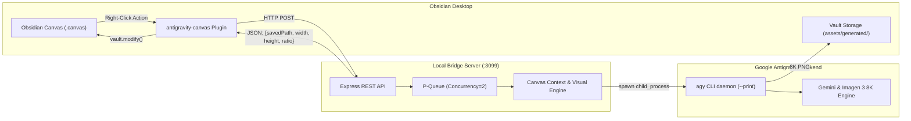

# 🌌 Obsidian Antigravity Canvas

<div align="center">

[](https://github.com/bleu-fire/obsidian-antigravity-canvas/releases)
[](https://opensource.org/licenses/MIT)
[](https://obsidian.md)
[](https://antigravity.google)
[](https://nodejs.org)

**Turn Obsidian Canvas into an AI-augmented visual ideation studio powered by Google Antigravity (`agy`).**  
*Zero API Keys • Zero Rate Limits • Studio-Grade 8K Imagery • 16:9 Context Wireframes • Gaming Keyart Suite*

</div>

---

## ⚡ 1-Click Universal Install

Run this single command in your terminal to set up the Bridge, Obsidian Plugin, and all AI Skills automatically:

```bash
curl -fsSL https://raw.githubusercontent.com/bleu-fire/obsidian-antigravity-canvas/main/install.sh | bash
```

> **After installation**: In Obsidian, press <kbd>Ctrl</kbd> + <kbd>P</kbd> and run **`Reload app without saving`**.  
> Look for **`AGY ready` 🟢** in your bottom status bar.

---

## 🚀 Key Features

* **🔒 Zero Cloud API Keys / No Quota Limits**: Eliminates HTTP 429 `RESOURCE_EXHAUSTED` and 404 deprecated model errors. Operates via your local authenticated Google Antigravity (`agy`) CLI daemon.
* **🧠 Context-Aware Graph Traversal**: Automatically traverses upstream incoming edges in the Canvas graph to extract parent concepts, storylines, and root themes.
* **📐 Dynamic 16:9 Wireframe Generation**: Right-click any card to generate a structured 16:9 editorial wireframe card with Headline, Sub-headline, Composition Specs, and **Strategic Recommendations**.
* **🎨 5-Stage Visual Reasoning Protocol**: Analyzes semiotics, optical lighting physics (PBR shaders, Fresnel reflections, chiaroscuro), and removes cheap AI clichés before rendering.
* **🎮 Gaming & Thumbnail Suite**: Specialized keyart for Grimdark Soulsborne, Cyberpunk Esports, and high-CTR YouTube covers with scale-contrast staging.
* **📏 Exact Aspect Ratio Canvas Cards**:
  * **16:9** (`560 × 315 px`) for Cinematic Scenes, Wireframes, and YouTube Thumbnails.
  * **1:1** (`360 × 360 px`) for 3D Hardware Marks, Logos, and Legendary Loot.
  * **3:4** (`330 × 440 px`) for Vertical Character Portraits and Posters.
* **🛡️ Zero Coordinate Collisions**: Mathematically auto-centers child nodes relative to parent cards with clean spacing.
* **⚡ 24-Hour Cache**: SHA-256 content-addressable local caching prevents redundant inference latency.

---

## 🏗️ Architecture



---

## 💡 How to Use in Obsidian Canvas

Right-click any node inside an active `.canvas` document:

| Menu Item | Action | Result |
|---|---|---|
| **🧠 AGY Brainstorm 3 ideas** | Generates 3 contextual branches from upstream narrative | 3 color-coded connected cards |
| **📐 AGY 16:9 Wireframe Layout** | Architects a structured 16:9 layout card with next-step advice | 560×315 px wireframe card with Specs & Strategy |
| **💡 AGY Expand with Recommendations** | Deepens concept & recommends next asset to create | Connected expansion card with `[!TIP]` |
| **🖼️ AGY Generate image (Auto Context)** | Auto-detects genre & renders 8K asset matching context | Embedded visual card matched to optimal ratio |
| **🎮 AGY Style: Gaming Keyart (16:9)** | Renders AAA gaming splash art / high-CTR thumbnail | 560×315 px Unreal Engine 5 render card |
| **⚔️ AGY Style: Legendary Loot (1:1)** | Renders macro close-up weapon or cybernetic relic | 360×360 px studio-lit item card |
| **🎬 AGY Style: Cinematic Dramatic** | Anamorphic 50mm chiaroscuro film still | 16:9 high-contrast cinematic card |
| **🎨 AGY Style: 3D Cartoon / Pixar** | Expressive feature-film 3D animated render | 3D stylized character or world card |
| **🌈 AGY Style: Hyper-Vibrant Colors** | Synthwave / Chromatic neon prismatic dispersion | 16:9 ultra-vivid color harmony card |

---

## 📁 Repository Structure

```text
obsidian-antigravity-canvas/
├── install.sh                          # Universal 1-click installer
├── README.md                           # Documentation & quickstart
├── LICENSE                             # MIT License
├── docs/
│   ├── ARCHITECTURE.md                 # Electron sandbox & bridge architecture
│   ├── QUICKSTART.md                   # 2-minute setup guide
│   ├── CANVAS_SIZING_GUIDE.md          # 16:9 / 1:1 / 3:4 dimension matrix
│   └── AI_AGENT_PROMPT.md              # System prompt for Claude and AGY
├── plugin/                             # Obsidian Plugin
│   ├── manifest.json                   # v2.5.0 metadata
│   ├── main.js                         # Canvas graph traversal & UI menu
│   └── styles.css                      # Status bar indicator styles
├── bridge/                             # Local HTTP Bridge Daemon
│   ├── server.js                       # Express REST endpoints
│   ├── antigravity.js                  # CLI runner, prompt architect & reasoning
│   ├── queue.js                        # Task queue & backoff
│   ├── start.sh                        # Daemon background launcher
│   └── package.json                    # Dependencies
└── skills/                             # AI Reasoning Protocols
    ├── canvas-visual-reasoning/        # 5-stage cognitive prompt synthesis
    ├── canvas-context-director/        # Graph context harvesting
    ├── gaming-visual-engine/           # AAA Unreal Engine 5 gaming art
    ├── gaming-thumbnail-architect/     # High-CTR YouTube thumbnail formulas
    ├── macro-asset-artisan/            # Extreme macro loot & weapon renders
    ├── canvas-visual-artisan/          # Aspect ratio & zero-collision layout
    ├── thumbnail-architect/            # Cognitive psychology of thumbnails
    ├── antigravity-brand-reasoning/    # 3D luxury brand marks & emblems
    └── antigravity-miro-canvas/        # Miro-style spatial layout protocol
```

---

## 🤖 Instructions for AI Assistants (Claude / AGY)

If you are using **Claude**, **Google Antigravity (AGY)**, or another LLM, paste the contents of [`docs/AI_AGENT_PROMPT.md`](docs/AI_AGENT_PROMPT.md) into your chat. The AI will immediately understand the local bridge endpoints, context traversal rules, and canvas coordinate math.

---

## 🛠️ Management Commands

* **Check Bridge Health**:
  ```bash
  curl -s http://127.0.0.1:3099/health
  ```
* **View Real-Time Logs**:
  ```bash
  tail -f /tmp/agy-bridge.log
  ```
* **Restart the Bridge**:
  ```bash
  bash ~/.gemini/antigravity-bridge/bridge/start.sh
  ```
* **Stop the Server**:
  ```bash
  fuser -k 3099/tcp
  ```

---

## 📄 License

This project is open-source under the [MIT License](LICENSE).
