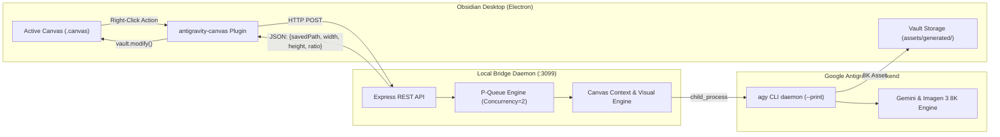

# Obsidian Antigravity Canvas

<div align="center">

[](https://github.com/bleu-fire/obsidian-antigravity-canvas/releases)
[](https://opensource.org/licenses/MIT)
[](https://obsidian.md)
[](https://antigravity.google)
[](https://nodejs.org)

**High-fidelity visual ideation and spatial canvas intelligence powered by Google Antigravity (agy).**  
*Zero API Keys • No Quota Restrictions • Studio 8K Imagery • 16:9 Context Wireframes • Gaming Keyart Suite*

</div>

---

## Quick Installation

Execute this command in your terminal to configure the Bridge Daemon, Obsidian Plugin, and AI Reasoning Skills:

```bash
curl -fsSL https://raw.githubusercontent.com/bleu-fire/obsidian-antigravity-canvas/main/install.sh | bash
```

> **Post-installation**: Open Obsidian, press <kbd>Ctrl</kbd> + <kbd>P</kbd>, and run **`Reload app without saving`**.  
> The status bar will confirm **`AGY ready`**.

---

## Core Capabilities

* **Zero Cloud API Keys**: Eliminates HTTP 429 `RESOURCE_EXHAUSTED` and 404 service deprecation errors. Communicates locally with your authenticated Google Antigravity (`agy`) daemon.
* **Context-Aware Graph Traversal**: Automatically follows incoming canvas edges to extract parent narrative arcs, chapter themes, and root project definitions.
* **16:9 Editorial Wireframe Generation**: Synthesizes structured 16:9 layout cards with Headline Hooks, Sub-headlines, Composition Specifications, and Strategic Recommendations.
* **5-Stage Visual Reasoning Protocol**: Conducts semiotic analysis, optical staging (PBR shaders, Fresnel reflections, chiaroscuro contrast), and anti-cliché quality filtering prior to rendering.
* **Gaming & Keyart Suite**: Targeted production presets for Grimdark Soulsborne, Cyberpunk Esports, and high-CTR YouTube covers.
* **Exact Aspect Ratio Sizing**:
  * **16:9** (`560 x 315 px`): Cinematic compositions, editorial wireframes, and YouTube thumbnails.
  * **1:1** (`360 x 360 px`): Industrial 3D marks, brand emblems, and legendary game loot.
  * **3:4** (`330 x 440 px`): Vertical character portraits and editorial posters.
* **Zero Coordinate Collisions**: Automatically centers child cards relative to their parent source nodes with standardized spacing.
* **24-Hour Cache Layer**: Content-addressable SHA-256 local storage prevents duplicate inference latency.

---

## Architecture



---

## Canvas Menu Reference

Right-click any node within an active `.canvas` document:

| Menu Item | Action | Output |
|---|---|---|
| **AGY: Brainstorm 3 Ideas** | Derives three contextual sub-concepts from upstream story | Three connected cards with color coding |
| **AGY: 16:9 Wireframe Layout** | Architects a 16:9 layout card with next-step advice | 560 x 315 px card with Specs and Strategy |
| **AGY: Expand with Recommendations** | Deepens concept and outlines next asset to create | Connected analytical card with recommendation |
| **AGY: Generate Image (Auto Context)** | Auto-detects genre and renders 8K asset from context | Embedded visual card matched to optimal ratio |
| **AGY: Style - Gaming Keyart (16:9)** | Generates AAA gaming splash art or thumbnail | 560 x 315 px Unreal Engine 5 render card |
| **AGY: Style - Legendary Loot (1:1)** | Renders macro close-up weapon or cybernetic relic | 360 x 360 px studio-lit item card |
| **AGY: Style - Cinematic Dramatic** | Generates an anamorphic 50mm chiaroscuro still | 16:9 high-contrast cinematic card |
| **AGY: Style - 3D Cartoon (Pixar)** | Generates stylized 3D feature-film animation art | 3D stylized character or world card |
| **AGY: Style - Hyper-Vibrant Colors** | Generates high-dynamic chromatic neon artwork | 16:9 vivid color harmony card |

---

## Directory Layout

```text
obsidian-antigravity-canvas/
├── install.sh                          # Automated installation script
├── README.md                           # System documentation
├── LICENSE                             # MIT License
├── docs/
│   ├── ARCHITECTURE.md                 # Technical specification of the bridge
│   ├── QUICKSTART.md                   # Setup guide and prerequisites
│   ├── CANVAS_SIZING_GUIDE.md          # Dimensional matrix and layout math
│   └── AI_AGENT_PROMPT.md              # Operational guide for Claude and AGY
├── plugin/                             # Obsidian Companion Plugin
│   ├── manifest.json                   # Plugin metadata v2.5.0
│   ├── main.js                         # Canvas graph traversal and UI integration
│   └── styles.css                      # Status indicator styles
├── bridge/                             # Local HTTP Bridge Daemon
│   ├── server.js                       # Express REST endpoints
│   ├── antigravity.js                  # CLI execution, prompt synthesis, reasoning
│   ├── queue.js                        # Request queue and backoff management
│   ├── start.sh                        # Background process launcher
│   └── package.json                    # Node.js dependencies
└── skills/                             # AI Reasoning Protocols
    ├── canvas-visual-reasoning/        # 5-stage cognitive prompt synthesis
    ├── canvas-context-director/        # Graph context harvesting
    ├── gaming-visual-engine/           # AAA Unreal Engine 5 art direction
    ├── gaming-thumbnail-architect/     # High-CTR thumbnail formulation
    ├── macro-asset-artisan/            # Macro loot and relic rendering
    ├── canvas-visual-artisan/          # Aspect ratio and layout geometry
    ├── thumbnail-architect/            # Visual semiotics and cognitive psychology
    ├── antigravity-brand-reasoning/    # 3D brand marks and structural emblems
    └── antigravity-miro-canvas/        # Whiteboard spatial synthesis
```

---

## Integration with AI Agents (Claude / AGY)

For workflows orchestrated directly by **Claude**, **Google Antigravity**, or automated scripts, provide the prompt template located in [`docs/AI_AGENT_PROMPT.md`](docs/AI_AGENT_PROMPT.md). The agent will interface directly with the bridge endpoints.

---

## Process Management

* **Health Check**:
  ```bash
  curl -s http://127.0.0.1:3099/health
  ```
* **View Activity Logs**:
  ```bash
  tail -f /tmp/agy-bridge.log
  ```
* **Restart Bridge Daemon**:
  ```bash
  bash ~/.gemini/antigravity-bridge/bridge/start.sh
  ```
* **Terminate Bridge Daemon**:
  ```bash
  fuser -k 3099/tcp
  ```

---

## License

This project is released under the [MIT License](LICENSE).
