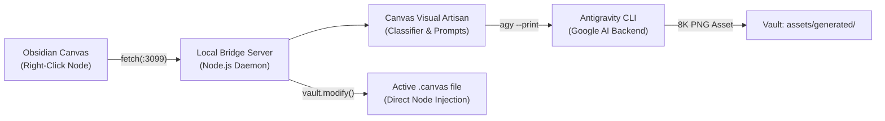

# 🌌 Obsidian Antigravity Canvas

[](https://github.com/bleu-fire/obsidian-antigravity-canvas)
[](https://opensource.org/licenses/MIT)
[](https://obsidian.md)
[-green.svg)](https://antigravity.google)

> Turn **Obsidian Canvas** into an AI-augmented visual ideation whiteboard powered by **Google Antigravity (`agy`)** — with **zero external API keys**, **zero rate limits**, studio-grade **8K image rendering**, and **intelligent aspect-ratio sizing**.

---

## ⚡ Highlights

* **🔒 No API Key Required**: Bypasses rate limits and daily quotas (no HTTP 429 `RESOURCE_EXHAUSTED` errors). Uses your local authenticated `agy` CLI daemon.
* **🎨 Studio-Grade Visual Artisan**: Generates real, photorealistic PNG assets (not low-res SVGs) with cinematic lighting, PBR material physics, and anti-cliché quality guards.
* **📐 Dynamic Aspect-Ratio Matching**:
  * **16:9** (560×315 px) for High-CTR YouTube covers, cinematic landscapes, and wireframes.
  * **1:1** (360×360 px) for luxury 3D brand marks, hardware emblems, and icons.
  * **3:4** (330×440 px) for character portraits and vertical editorial plates.
* **🧠 Spatial Idea Brainstorming**: Right-click any concept node to spawn 3 structured, color-coded sub-ideas connected with directional arrows.
* **⚡ 24-Hour Smart Cache**: Eliminates redundant inference delays using content-addressable SHA-256 caching.
* **🛡️ Zero Coordinate Collisions**: Mathematically auto-centers child nodes relative to parent cards.

---

## 🏗️ Architecture



For an in-depth breakdown of the sandbox bridge and architecture decisions, see [ARCHITECTURE.md](docs/ARCHITECTURE.md).

---

## 📦 Repository Structure

```text
obsidian-antigravity-canvas/
├── docs/                           # Comprehensive technical documentation
│   ├── ARCHITECTURE.md             # Electron sandbox & local bridge specifications
│   ├── QUICKSTART.md               # 2-minute quick setup guide
│   └── CANVAS_SIZING_GUIDE.md      # Aspect ratios and zero-collision math
├── plugin/                         # Obsidian companion plugin
│   ├── manifest.json               # Plugin metadata
│   ├── main.js                     # Canvas menu, vault updater & UI logic
│   └── styles.css                  # Status bar styling
├── bridge/                         # Local HTTP-to-AGY bridge daemon
│   ├── server.js                   # Express server with REST endpoints
│   ├── antigravity.js              # agy CLI wrapper, prompt builder & classifier
│   ├── queue.js                    # Concurrency limiter & exponential backoff
│   ├── start.sh                    # One-line background startup daemon
│   └── package.json                # Dependencies
└── skills/                         # Reusable AI reasoning protocols
    ├── canvas-visual-artisan/      # Visual prompt engineering & sizing rules
    ├── thumbnail-architect/        # High-CTR YouTube thumbnail psychology
    ├── antigravity-brand-reasoning/# Luxury 3D brand mark protocols
    └── antigravity-miro-canvas/    # Miro-style spatial layout workflows
```

---

## 🚀 Quick Setup

### 1. Start the Bridge Server
```bash
cd bridge
npm install
bash start.sh
```

### 2. Install the Obsidian Plugin
Copy the `plugin/` folder to your vault's plugins directory:
```bash
mkdir -p "$HOME/Documents/Obsidian Vault/.obsidian/plugins/antigravity-canvas"
cp -r plugin/* "$HOME/Documents/Obsidian Vault/.obsidian/plugins/antigravity-canvas/"
```

### 3. Enable in Obsidian
1. Open **Obsidian** ➔ **Settings** ➔ **Community plugins**.
2. Enable **Antigravity Canvas**.
3. The bottom status bar will show **`AGY ready` 🟢**.

---

## 💡 How to Use

Right-click any node in your `.canvas` document:

| Action | Description | Result |
|---|---|---|
| **🧠 AGY Brainstorm 3 ideas** | Generates 3 contextual branches | 3 connected cards with custom colors |
| **🖼️ AGY Generate image (Artisan 8K)** | Creates an 8K render matched to the concept | Embedded image card (16:9, 1:1, or 3:4) |
| **✍️ AGY Expand text** | Expands concept into 3 rich sentences | Connected description card |

---

## 🛠️ Management & Monitoring

* **Health Check**:
  ```bash
  curl -s http://127.0.0.1:3099/health
  ```
* **Live Streaming Logs**:
  ```bash
  tail -f /tmp/agy-bridge.log
  ```
* **Kill Server**:
  ```bash
  fuser -k 3099/tcp
  ```

---

## 📄 License

This project is licensed under the [MIT License](LICENSE).
