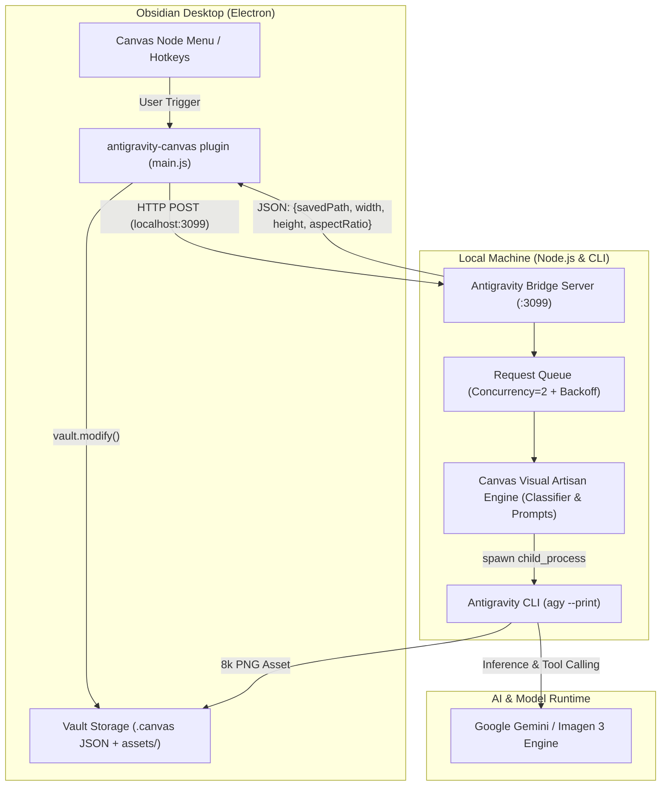

# System Architecture: Obsidian Antigravity Canvas

This document outlines the architectural design that bridges the desktop Obsidian environment with the local Google Antigravity AI runtime.

---

## 1. The Architectural Challenge

Obsidian runs as an **Electron application** within a restricted renderer sandbox:
- Direct shell spawning from UI threads is restricted or unportable.
- Standard cloud LLM plugins require proprietary API keys, which are prone to harsh daily quota limits (e.g. 70 requests/day on free tiers, leading to HTTP 429 `RESOURCE_EXHAUSTED` errors).
- Deprecated model endpoints (such as `gemini-2.0-flash` sunsetting) trigger sudden HTTP 404 `NOT_FOUND` service errors.

---

## 2. The Solution: Local Bridge Architecture

---

## 3. Core Components

### A. Obsidian Plugin (`plugin/main.js`)
* **Lightweight Client**: Contains zero direct cloud API credentials. Communicates strictly with `http://127.0.0.1:3099`.
* **Dynamic Canvas Modifier**: Reads and modifies `.canvas` files directly through the Obsidian `app.vault` API, bypassing outdated DOM/view methods.
* **Aspect-Ratio Aware Geometry**: Dynamically dimensions new image nodes according to the aspect ratio returned by the bridge (`16:9` -> 560×315, `1:1` -> 360×360, `3:4` -> 330×440).
* **Live Health Polling**: Continually updates an Obsidian status bar item (`AGY ready` vs `AGY offline`).

### B. Antigravity Bridge (`bridge/server.js` & `antigravity.js`)
* **Headless Orchestrator**: Wraps the `agy` CLI binary using `--print --dangerously-skip-permissions`.
* **Zero Quota Constraints**: Uses local agent credentials rather than rate-limited third-party API keys.
* **Cache Layer**: 24-hour SHA-256 content-addressable local cache (`.cache/`) to eliminate duplicate inference latency.
* **Queue Engine (`bridge/queue.js`)**: Limits concurrency to 2 parallel tasks with exponential backoff.

### C. Visual Artisan Engine (`skills/canvas-visual-artisan/`)
* **Semantic Classifier**: Analyzes node text to determine whether the user intends a video thumbnail, 3D brand asset, or character portrait.
* **5-Layer Prompt Engineering**: Augments raw prompts with lighting, material physics, camera optics, studio backdrops, and negative quality guards.
